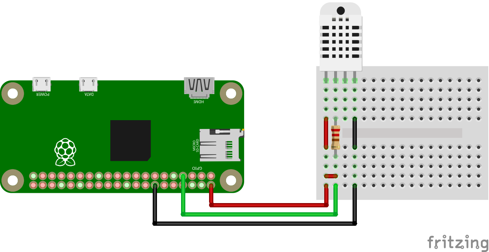

# DHT22 Temperature sensor demonstration

## Overview

The Python program demonstrates the functionality of a DHT22 sensor on Raspberry Pi. Useful for testing that connections are valid.

**Requires Adafruit DHT library.** Default pin for data is GPIO4.

Also includes:

* 1602 LCD support for printing values on lcd screen. Configuration in code.
* Tkinter GUI (`gui.py`)

Hardware configuration is shown in image below.

## How to use

1. Install dependancies
2. Run `python3 dht22.py`

## TBI

* Logging for values

---

